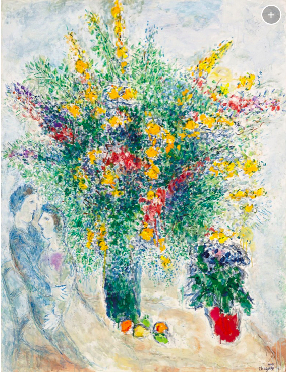

Here is a Mean Shift Analysis of the Uniform Crime Reporting data published by the FBI.
I use TensorFlow 2.0 to do the analysis and bokeh to create the map.

- [UCRanalysis.ipnyb](/crime_analysis/UCRanalysis.ipnyb)
- [crime_us_map.html](/crime_analysis/crime_us_map.html)

