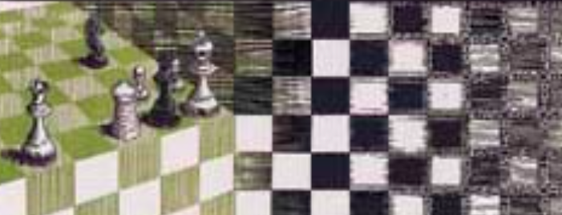

## Geometric Deep Learning Study Group
We're working on our way through ["Geometric Deep Learning: Grids, Groups, Graphs, Geodesics, and Gauges"](https://geometricdeeplearning.com/book/)
by Michael M. Bronstein, Joan Bruna, Taco Cohen, Petar Veličković
We’ll use the chapters rather than the big pdf, and also presenting on other papers.

[To join the study group, fill out this form](https://docs.google.com/forms/d/e/1FAIpQLSe6T7KujHbJBLQaDSMcnaCFrfvKjDLrtH8CSZVWVr6G4HedNg/viewform?usp=header)

### Session 1: August 11, at 11am EDT/3pm GMT/5pm CEDT

[Slides](https://github.com/ARMargolis/armargolis.github.io/blob/main/Geometric%20Deep%20Learning%2020250811.pdf)

### Session 2: September 1, at 11am EDT/3pm GMT/5pm CEDT
Reading: [Introduction](https://geometricdeeplearning.com/book/introduction.html)

Lecture: [ICLR 2021 Keynote: GDL: The Erlangen Programme of ML by M Bronstein”](https://www.youtube.com/watch?v=w6Pw4MOzMuo) 

[To present fill out this form](https://docs.google.com/forms/d/e/1FAIpQLSfjuvRWuHfQ9M11uz9PUnq_3j_trOAcTyDG2a5yPoMvMWgfLQ/viewform?usp=header)

Additional References:
[Mathematical Foundations of Geometric Deep Learning by Borde and Bronstein](https://www.arxiv.org/abs/2508.02723)
[Introduction to Geometric Deep Learning by Patrick Nicolas](https://patricknicolas.substack.com/p/introduction-to-geometric-deep-learning)

Presentation Topic: [Geometric Deep Learning Reveals the Spatio-Temporal Features of Microscopic Motion](https://www.nature.com/articles/s42256-022-00595-0)
Aaron Presenting

### Session 3: September 22, at 11am EDT/3pm GMT/5pm CEDT
Reading: [Graphs](​​https://geometricdeeplearning.com/book/graphs.html)

Lecture: [Graph Neural Networks with Petar Velickovic](https://www.youtube.com/watch?v=fpb3j33RfTc)

Tutorial: [Intro to GNNs](https://colab.research.google.com/drive/1Z0D10BFMdbsTM7lwPYrrJCe7z4yD48EE)

Optional Lectures on GNNs: [Deep learning on graphs: successes, challenges by Bronstein](https://www.youtube.com/watch?v=PLGcx65MhCc)

[Graph Convolutional Networks by Federico Barbero](https://www.youtube.com/watch?v=CwHNUX2GWvE)

[Graph Attention Networks by Federico Barbero](https://www.youtube.com/watch?v=iAEDA8aDCZg)

Presentations:

Working through "Intro to GNNs" Tutorial, Part 1

Possible Project on [TacticAI](https://www.nature.com/articles/s41467-024-45965-x)

### Session 4: October 13, at 11am EDT/3pm GMT/5pm CEDT

Lecture: [Graph Neural Networks for Geometric Graphs by Chaitanya Joshi](https://www.youtube.com/watch?v=VKj5wzZsoK4)

Tutorials: [Intro to GNNs, Part 2](https://colab.research.google.com/github/ARMargolis/GDL100Practical2025/blob/main/GDL100_Practical1_2025.ipynb)

[Molecular Property Prediction with GNNs, Parts 0 and 1](https://colab.research.google.com/github/ARMargolis/GDL100Practical2025/blob/main/GDL100_Practical_3_2025.ipynb)

Presentations:
[Expressivity and Under-reaching](https://github.com/ARMargolis/armargolis.github.io/blob/main/Geometric%20Deep%20Learning%2020251013.pdf)
Working through "Molecular Property Prediction with GNNs" tutorial
Deciding on which project to work on: Global Football, NFL Big Data Bowl, or Fake News Detection

### Session 5: November 3, at 11am EST/4pm GMT/5pm CEST
Readings (blogs by Bronstein and collaborators): 
[Expressive power of graph neural networks and the Weisfeiler-Lehman test
](https://medium.com/data-science/expressive-power-of-graph-neural-networks-and-the-weisefeiler-lehman-test-b883db3c7c49)
[Beyond Weisfeiler-Lehman: using substructures for provably expressive graph neural networks](https://medium.com/data-science/beyond-weisfeiler-lehman-using-substructures-for-provably-expressive-graph-neural-networks-d476ad665fa3)
[GNNs through the lens of Differential Geometry and Algebraic Topology] (https://medium.com/data-science/graph-neural-networks-through-the-lens-of-differential-geometry-and-algebraic-topology-3a7c3c22d5f)
[Over-squashing, Bottlenecks, and Graph Ricci curvature](https://blog.x.com/engineering/en_us/topics/insights/2022/over-squashing--bottlenecks--and-graph-ricci-curvature)

Lectures:
[Discrete Ollivier-Ricci curvature for data visualization and analysis by Abigail Hickok](https://www.youtube.com/watch?v=MD1sFhx77XE)
Watch the first 10 minutes to understand discrete curvature

[Curvature and Over-Squashing in GNNs by Francesco Giovanni][(https://www.youtube.com/watch?v=pJyFg9NF7LQ)
](https://youtu.be/pJyFg9NF7LQ?si=HXsi0sAmzFJI31qL&t=600)
You can skip the first 10 minutes and start at 10:00

Tutorials: [Molecular Property Prediction with GNNs, Parts 3-5](https://colab.research.google.com/github/ARMargolis/GDL100Practical2025/blob/main/GDL100_Practical_3_2025.ipynb)

Presentations:
[Graph Curvature and Oversquashing](https://github.com/ARMargolis/armargolis.github.io/blob/main/Geometric%20Deep%20Learning%2020250811.pdf)

### Session 6: November 17, at 11am EST/4pm GMT/5pm CEST

Readings: [Foundations of Equivariant Learning](https://geometricdeeplearning.com/book/algebraicpriors.html)

[Foundations of Supervised Learning](https://geometricdeeplearning.com/book/foundations.html)
(Optional)

Lecture: [Equivariant Networks by Taco Cohen](https://slideslive.com/38943570/equivariant-networks)
Only Part 1 (through 1:20)

Tutorials: [Group Equivariant Neural Networks](https://colab.research.google.com/drive/1h7U15-qFC2yy6roRIfLPk5TSlo6sONsm)

### Session 7: December 1, at 11am EST/4pm GMT/5pm CEST

Readings: [Foundations of Geometric Learning](https://geometricdeeplearning.com/book/geometricpriors.html)

[Foundations of Supervised Learning](https://geometricdeeplearning.com/book/foundations.html)
(Optional)

***

Possible Presentation Topics:
[Valence Labs](https://portal.valencelabs.com)
[Graph Learning on Wednesdays](https://sites.google.com/view/graph-learning-on-weds)

## Previous projects:

- Privacy-preserving Detection of Violence in Cameras
Writing a privacy product specification for a privacy-preserving neural network for video analysis as part of my capstone for the [OpenMined course](https://courses.openmined.org/courses), "Our Privacy Opportunity." 
  [Privacy-Preserving Violence Detector](https://github.com/ARMargolis/priv_violence_detector/blob/main/README.md)
    
- Mean Shift Analysis of the Uniform Crime Reporting data published by the FBI.
I use TensorFlow 2.0 to do the analysis and bokeh to create the map.
  - [UCRanalysis.ipnyb](/crime_analysis/UCRanalysis.ipnyb)
  - [UCRanalysis.html](/crime_analysis/UCRanalysis.html)
  - [crime_us_map.html](/crime_analysis/crime_us_map.html)
  
- Better Bin Packing Through Matrix Multiplication
Using matrix multiplication to speed up a classic optimization problem

  [Latest Version](https://github.com/ARMargolis/matrix_bin_packing)

Excerpt of Metamorphosis II, by Marc Chagall

- Optimizing Sailor Health for NavalX's Hack The Machine.
Part of second place finish in Data Science Track. Wrote code for [Challenge 3: Optimizing Sailor Health](https://github.com/ARMargolis/Track2_Challenges_Data/tree/main/Challenge3)

- Pruned Neural Networks for Melanoma Detection
Competing in Kaggle's [Melanoma Detection Competition](https://www.kaggle.com/c/siim-isic-melanoma-classification/data) through application of the [Lottery Ticket Hypothesis](https://arxiv.org/pdf/1803.03635.pdf) for neural network pruning.
Secondary goal of building more explainable artificial intelligence. [Repo here](https://github.com/ARMargolis/melanoma-pytorch)

- Quantum Computing for Network Analysis
A proof-of-concept for identifying likely asymptomatic CoVID-19 carriers through network analysis by applying simulated quantum computing with qiskit. Entry into Qiskit Community Summer Jam 2020 https://qiskit-community-summer-jam-new-england.hackerearth.com/

    [Final Presentation](https://github.com/ARMargolis/contact_tracer/blob/master/presentation/quantumhack.pptx)

End  of Metamorphosis II, by Marc Chagall

Future plans:

- [AI4EO Air Quality and Health Challenge](https://platform.ai4eo.eu/challenge/air-quality-and-health)
  
- Recursively defined sparse matrices
A new way to build, add, and multiply sparse matrixes for graph neural networks and pruning
